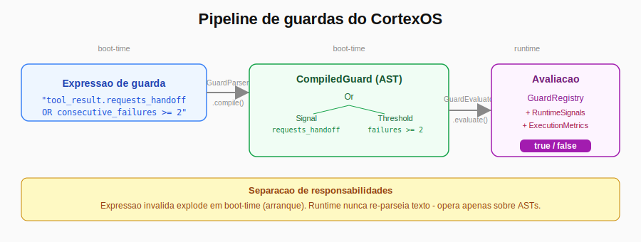
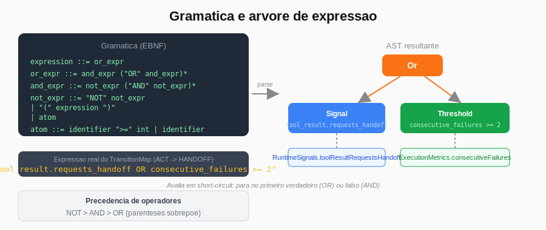
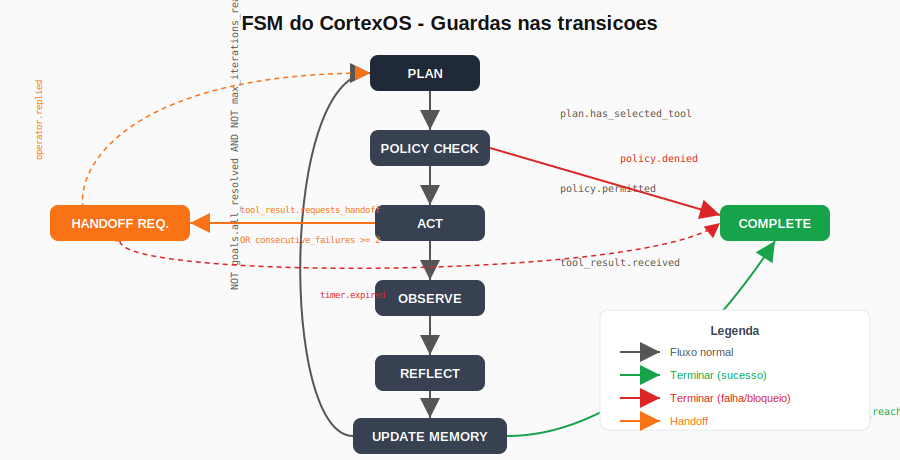

# A Mini-Linguagem que Controla as Transicoes da FSM do CortexOS

*[Read in English](../en/article.md)*

Quando a FSM do CortexOS precisou de transicoes com condicoes compostas, tinha uma escolha: hardcodar `if` aninhados ou construir algo que se lesse como texto. Escolhi a segunda opcao. Este artigo documenta o porque e o como.

## O Problema Com Condicoes de Transicao

Uma Finite State Machine (FSM) simples tem transicoes simples. `if (estado == A) vai para B`. Mas quando o agente precisa de decidir se transita de ACT para HANDOFF com base em mais do que um criterio, a coisa fica diferente.

No CortexOS, a transicao de ACT para HANDOFF_REQUESTED deve acontecer quando:

- A tool pediu handoff explicitamente, **OU**
- Houve pelo menos 2 falhas consecutivas

E a transicao de HANDOFF_REQUESTED para HANDOFF_ACTIVE deve acontecer apenas quando:

- O operador aceitou, **E**
- O temporizador ainda nao expirou

Como exprimir isto? A alternativa mais directa e esta:

```php
// Hardcoded numa funcao de transicao
if ($signals->toolResultRequestsHandoff || $metrics->consecutiveFailures >= 2) {
    $this->transitionTo(AgentState::HANDOFF_REQUESTED);
}
```

Funciona. Mas agora imagina 15 transicoes, algumas com 3 ou 4 condicoes. O mapa de estados fica enterrado em logica condicional. Para perceber o que a FSM faz, tes de ler codigo PHP, nao um mapa declarativo. Testar uma condicao especifica obriga a instanciar toda a cadeia.

O CortexOS resolveu isto com uma linguagem de expressao minimalista.

## A Abordagem: Expressoes de Guarda como Texto

No `TransitionMap`, cada transicao declara as suas guardas como strings:

```php
$define(
    AgentState::ACT,
    AgentState::HANDOFF_REQUESTED,
    guards: [
        'tool_result.requests_handoff OR consecutive_failures >= 2',
    ],
    critical: [],
    deferred: ['start_timeout_timer', 'notify_operators_multichannel'],
);

$define(
    AgentState::HANDOFF_REQUESTED,
    AgentState::HANDOFF_ACTIVE,
    guards: [
        'operator.accepted',
        'NOT timer.expired',
    ],
    critical: ['persist_operator_assignment', 'cancel_timer'],
    deferred: [],
);
```

Estas strings sao a linguagem de guarda. O sistema compila-as para ASTs em boot-time e avalia-as em runtime sem voltar a parsear texto.

## A Gramatica (5 Regras)

```
expression  ::= or_expr
or_expr     ::= and_expr ("OR" and_expr)*
and_expr    ::= not_expr ("AND" not_expr)*
not_expr    ::= "NOT" not_expr | "(" expression ")" | atom
atom        ::= identifier ">=" integer | identifier
```

E tudo. Operadores em maiusculas. Precedencia: NOT > AND > OR. Parenteses sobrepoe.



## O Pipeline: Parse em Boot, Avalia em Runtime

O sistema tem uma separacao clara entre o que acontece no arranque e o que acontece em runtime.

**Boot-time:** O `GuardParser` recebe cada expressao, tokeniza, e constroi uma AST imutavel (`CompiledGuard`). Se a expressao tiver sintaxe invalida ou referenciar um identificador desconhecido, lanca `InvalidGuardExpressionException` imediatamente. A aplicacao nao arranca com um mapa de transicoes corrompido.

```php
// Acontece uma vez no construtor do TransitionMap
$compiled = array_map(
    fn(string $expression): CompiledGuard => $this->guardParser->compile($expression),
    $guards,
);
```

**Runtime:** O `GuardEvaluator` percorre a AST recursivamente. Quando encontra um no folha, delega ao `GuardRegistry`, que le os valores reais dos sinais e metricas.

```php
// Avaliacao de um no na AST
return match ($node->type) {
    GuardNodeType::Signal    => $this->registry->evaluate($node->identifier, $ctx),
    GuardNodeType::Threshold => $this->registry->evaluate(
        "{$node->identifier} >= {$node->threshold}", $ctx,
    ),
    GuardNodeType::Not  => ! $this->evaluateNode($node->left, $ctx),
    GuardNodeType::And  => $this->evaluateNode($node->left, $ctx)
                        && $this->evaluateNode($node->right, $ctx),
    GuardNodeType::Or   => $this->evaluateNode($node->left, $ctx)
                        || $this->evaluateNode($node->right, $ctx),
};
```

O AND e o OR avaliam em short-circuit, tal como no PHP nativo.



## Os Atomos: Sinais e Thresholds

A linguagem tem dois tipos de atomo:

**Sinais** sao flags booleanas transitórias produzidas durante cada iteracao da FSM. Exemplos:

```
policy.permitted              -- a policy engine aprovou a execucao
tool_result.received          -- a tool retornou resultado
operator.accepted             -- o operador aceitou o handoff
goals.all_resolved            -- todos os goals activos foram resolvidos
max_iterations_reached        -- limite de 10 iteracoes atingido
```

**Thresholds** sao comparacoes numericas contra metricas acumuladas:

```
consecutive_failures >= 2     -- duas ou mais falhas seguidas
```

A separacao nao e apenas conceptual: o `GuardParser` trata os dois tipos de forma diferente, e o `GuardRegistry` tem listas distintas para cada um. Isto impede que um sinal booleano seja usado em posicao de threshold (`operator.accepted >= 2` seria invalido e explode em boot-time).

## Onde Cada Sinal Vem

O `GuardContext` agrega quatro fontes de informacao:

- `RuntimeSignals`: flags transitórias da iteracao corrente (produzidas pelo CortexAgent durante `runActState()`, `runPolicyCheckState()`, etc.)
- `ExecutionMetrics`: contadores acumulados (iteracoes, falhas consecutivas, retries)
- `AgentContext`: estado cognitivo persistente (goals activos, politicas, persona)
- `AgentExecution`: campos do modelo de base de dados

O `GuardRegistry` sabe de onde ler cada sinal. A logica de resolucao fica centralizada num so lugar:

```php
return match ($guard) {
    'policy.permitted'             => $ctx->signals->policyPermitted,
    'goals.all_resolved'           => $this->goalsAllResolved($ctx),
    'max_iterations_reached'       => $ctx->metrics->iterationCount >= 10,
    'operator.accepted'            => $ctx->signals->operatorAccepted,
    // ...
};
```

## O Mapa Completo das Transicoes



O mapa declara todas as transicoes validas, com as guardas que as protegem, os efeitos criticos (sincronos, dentro da transaccao de base de dados) e os efeitos diferidos (jobs assincronos). Se um efeito critico falhar, a transicao falha e o estado nao avanca.

```php
// Transicao com efeito critico e diferido
$define(
    AgentState::UPDATE_MEMORY,
    AgentState::PLAN,
    guards:   [
        'NOT goals.all_resolved',
        'NOT max_iterations_reached',
    ],
    critical: ['persist_memory_updates'],  // falha bloqueia transicao
    deferred: [],
);
```

## O que Esta Abordagem Ganha

**Legibilidade.** O `TransitionMap` lê-se como especificacao, nao como codigo de controlo. Para perceber o que a FSM faz, basta ler as strings de guarda.

**Fail fast.** Expressao invalida - seja por typo num identificador ou por sintaxe incorrecta - lanca excepcao no arranque, nao numa transicao em producao.

**Testabilidade.** O `GuardEvaluator`, o `GuardParser` e o `GuardRegistry` sao testáveis de forma completamente independente. Para testar uma guarda especifica, basta construir um `GuardContext` com os valores desejados - sem instanciar o `CortexAgent`, sem base de dados, sem LLM.

**Extensao sem risco.** Adicionar um novo sinal requer tres passos: adicionar a constante ao `GuardSignals`, adicionar ao `KNOWN_SIGNALS` do `GuardRegistry`, e implementar a resolucao no `evaluate()`. O parser e o evaluator ficam intocados.

## O Que Esta Abordagem Nao Faz

Nao e uma linguagem de proposito geral. Nao tem variaveis, funcoes, loops ou tipos. E especificamente desenhada para exprimir condicoes booleanas compostas sobre um conjunto fixo de sinais e metricas.

Tambem nao avalia expressoes arbitrarias em runtime. O conjunto de sinais e fechado: adicionar um novo sinal requer mudanca de codigo, nao apenas uma string diferente na expressao de guarda. Isto e uma decisao deliberada de seguranca.

## Referências

Ver [`REFERENCES.md`](./REFERENCES.md).

Para o codigo completo, incluindo `TransitionMap` com todas as transicoes declaradas:
https://github.com/ecnmee/synapse-notes/tree/main/articles/cortex-guard-dsl/pt/code

---

Usas FSMs em producao? Como resolves as condicoes de transicao compostas?

Deixa nos comentários.
