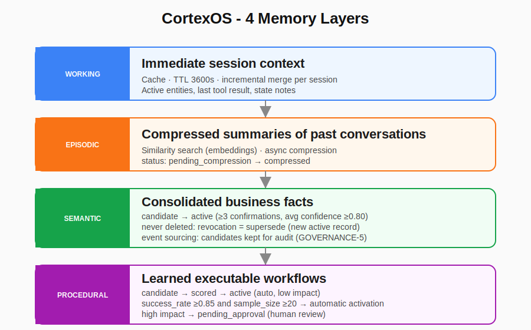
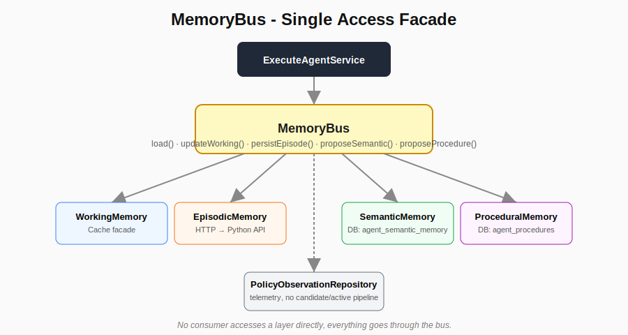
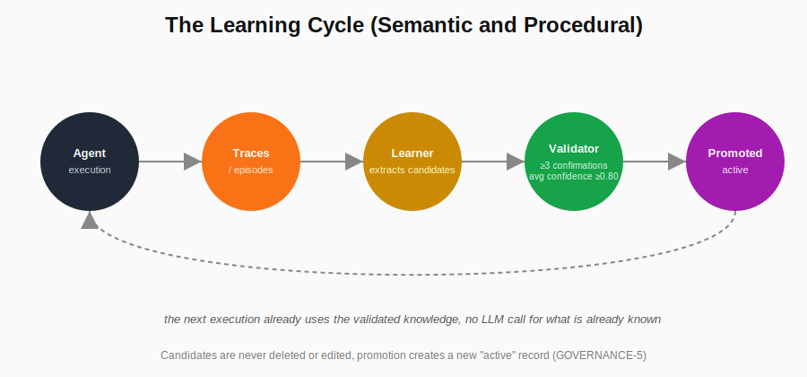

# The 4 Memory Layers That Could Change How We Build AI Agents

*[Ler em português de Angola](../pt/article.md)*

Hey, how's it going?

About 3 months ago I was hired to build **Simplifika AI**, a customer-support assistant powered by AI. The goal is simple: help customers resolve questions using the company's own knowledge base. But the deeper I got into the project, the clearer it became that there was room to go well beyond the usual approach.

That's how **CortexOS** started, the cognitive kernel behind Simplifika. An agent built in PHP, with a Finite State Machine (FSM), layered reflection, intelligent routing, and, most importantly, a memory architecture designed for real evolution, not just for "remembering things."

I'm not here to sell the project. I want to share an idea I think matters for anyone building agents and chatbots: **how to design memory that's actually good**, instead of relying only on huge prompts and vector search.

## The pattern almost everyone uses, and where it breaks down

Today, most agents follow more or less the same model:

- Pack the prompt with as much context as possible (*prompt stuffing*), the technique I used in version 1 of the Simplifika AI kernel;
- Use a **vector store + RAG** (Retrieval-Augmented Generation) to fetch relevant documents.

This pattern became widespread because it's relatively easy to implement and works well at the start. You see it in LangChain, LlamaIndex, CrewAI, AutoGen, and in almost every agent tutorial out there.

**Why did it become the standard?** Because it's the fastest path. RAG, popularized by the 2020 paper, solved a real problem: LLMs forget things and have no access to private data. But over time, this model shows its limits:

- The agent doesn't actually "learn", it only retrieves information that's already there.
- Every new conversation burns tokens repeating the same context.
- Knowledge doesn't accumulate cleanly over time.
- Mistakes repeat, because there's no structured validation of what was "learned."

For Simplifika, I wanted something different, a version 2 of the kernel, but with the capacity to go further.

## The proposal: 4 memory layers, each with a defined role

Instead of "context + RAG", I structured CortexOS's memory into **four layers**, each with a clear responsibility and a different persistence model.

### 1. Working Memory, the agent's RAM

This is the conversation's immediate state: active entities, the last tool result, temporary notes. It lives in cache with a 1-hour TTL, and updates are *merged*, never a full replacement of the session state. It's fast and deliberately volatile: once the session closes, there's no reason to keep this around forever.

### 2. Episodic Memory, past episodes lived through

This holds compressed summaries of past conversations, searchable by semantic similarity via embeddings. CortexOS doesn't store the whole conversation, it stores just enough to recognize "I've seen something like this before." Compression happens asynchronously, off the critical execution path: an episode enters with `pending_compression` status and is only processed later by a dedicated job.

### 3. Semantic Memory, consolidated facts

This is the layer for validated knowledge about the business. Things like "the maximum delivery time is 5 business days" or "VAT in Angola is 14%." And here's the important part: **this isn't just vector search.** There's a real pipeline:

1. The Learner observes executions and proposes **candidates**, each proposal for the same fact counts as an independent confirmation.
2. A validator (`SemanticValidator`) only promotes a candidate to **active** once it shows up in at least **3 distinct confirmations**, with an average confidence of at least **0.80**.
3. An active fact is never deleted or edited directly. Correcting it creates a new record, marking the old one as `superseded`, the full history stays auditable.

This "never delete, only supersede" rule is treated as a governance invariant in the system: every knowledge decision leaves a trail.

### 4. Procedural Memory, my favourite layer

This holds **sequences of actions that already proved to work**. For example: "when a customer asks about an overdue invoice, workflow X resolves it most of the time." Each procedure accumulates a success rate (`success_rate`) and a sample size (`sample_size`).

Once a procedure reaches **at least 20 observed executions** and a success rate of **85% or more**, it gets promoted automatically to `active`, but only if it's classified as low impact. High-impact procedures, even with good numbers, go to `pending_approval`: a human has to approve before the agent starts executing them without calling the LLM.

## Everything goes through one single point: the MemoryBus

No part of the agent accesses a memory layer directly. All reads and writes go through a single facade, the `MemoryBus`.

This brings two practical advantages that only became obvious after testing the system:

- **Testability.** Since `MemoryBus` is `final`, any consumer that depended on it directly would be impossible to isolate in a unit test without touching its concrete dependencies (cache, database, Python API). That's why an interface (`MemoryBusInterface`) exists: consumers only know the contract, never the implementation.
- **Isolated failures don't take down the agent.** Each method on the bus has its own `try/catch`. If the episodic layer fails (say, the Python service is down), the agent keeps running with empty memory for that layer, instead of failing the whole execution.

## The cycle that actually makes the difference

Having four separate layers, on its own, doesn't solve anything. What matters is the full cycle:

Agent executes → generates traces (episodes, tool results) → the Learner analyzes them and produces candidates → the validator promotes whatever is reliable enough → memory gets updated → the next conversation already uses what was learned, instead of rediscovering the same thing again.

Over time, the agent gets faster, cheaper, and more consistent, because a growing share of decisions stops depending on a call to the LLM.

## What's the actual difference?

Most agent frameworks today focus on **retrieving** information. CortexOS focuses on **accumulating and validating** knowledge, and treats that as a governance pipeline, not an implementation detail.

Few teams have something like this openly documented today. Anthropic and OpenAI are exploring long-term memory in agents, but in practice most enterprise solutions still live entirely in the RAG + big-prompt model. Companies like Adept, Imbue, and a handful of autonomous-agent startups are heading in this direction, but it's still mostly unexplored territory in production.

## For anyone building agents

If you're building an agent or a chatbot, it's worth asking:

- How much of your agent actually learns over time, instead of just retrieving?
- How much does it still depend on calling the LLM on nearly every interaction?
- Do you have an explicit criterion for validating what it "learns", or are you trusting the first pattern that shows up?

Memory isn't the most glamorous part of an agent. But it's probably the one that weighs the most on long-term quality.

## References

This article builds on published work, it doesn't invent the concepts from scratch:

- Lewis, P. et al. (2020). *Retrieval-Augmented Generation for Knowledge-Intensive NLP Tasks*. NeurIPS. https://arxiv.org/abs/2005.11401
- Sumers, T. et al. (2023). *Cognitive Architectures for Language Agents* (CoALA). arXiv:2309.02427. https://arxiv.org/abs/2309.02427
- Anderson, J. R. (2007). *How Can the Human Mind Occur in the Physical Universe?* Oxford University Press (ACT-R). https://act-r.psy.cmu.edu/
- Laird, J. E. (2012). *The Soar Cognitive Architecture*. MIT Press. https://soar.eecs.umich.edu/
- Park, J. S. et al. (2023). *Generative Agents: Interactive Simulacra of Human Behavior*. arXiv:2304.03442. https://arxiv.org/abs/2304.03442
- Packer, C. et al. (2023). *MemGPT: Towards LLMs as Operating Systems*. arXiv:2310.08560. https://arxiv.org/abs/2310.08560
- Zhong, W. et al. (2023). *MemoryBank: Enhancing Large Language Models with Long-Term Memory*. arXiv:2305.10250. https://arxiv.org/abs/2305.10250

Full list, with notes on where CortexOS follows the literature and where it diverges, in [`REFERENCES.md`](./REFERENCES.md).

To review the real code backing the technical claims in this article, see [`synapse-notes/articles/cortex-memory-architecture/en/code`](https://github.com/ecnmee/synapse-notes/tree/main/articles/cortex-memory-architecture/en/code).

> **Post-publication note (P5.1):** the text above describes the system as it was when first published. The code in `en/code/` reflects the current state, which has since evolved: semantic memory now resolves conflicts between active facts for the same entity (the higher-confidence candidate supersedes the existing one via `supersede()`, instead of being blocked), the procedural pipeline dropped a ghost state (`validated`, which never had a component operating it) and gained a `ProceduralHealthMonitor` that deactivates degraded procedures, and domain episodes now live in their own table (`agent_domain_episodes`), separate from the legacy compression pipeline. Full detail in [`code/README.md`](./code/README.md) and [`CHANGELOG.md`](../CHANGELOG.md). The published article text was not rewritten retroactively; this note is what links the publication to the actual state of the code.

---

What about you? What's been your biggest challenge building memory into your agents? Have you tried separating procedural memory from semantic memory?

Leave a comment, I'll read and reply.
