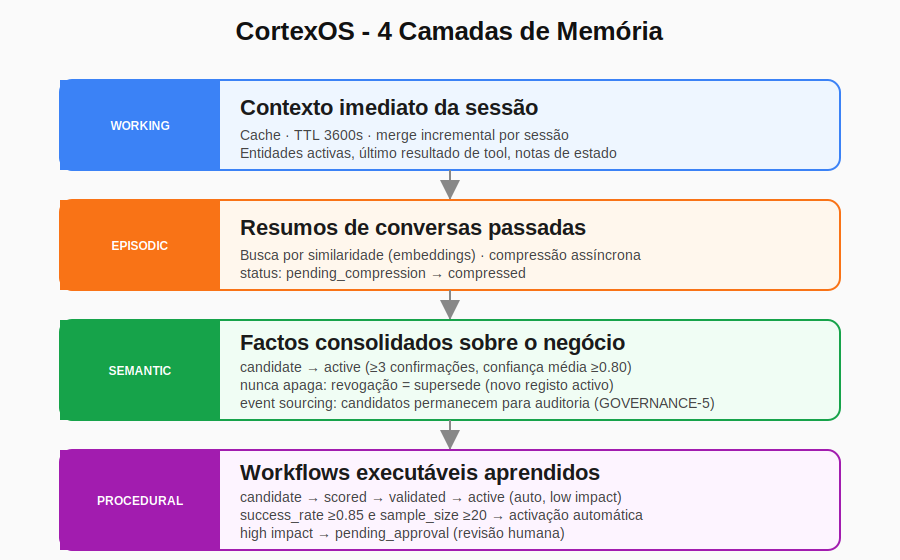
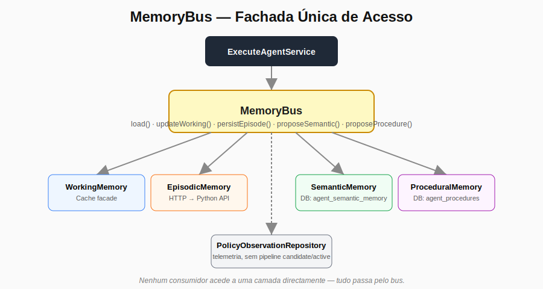
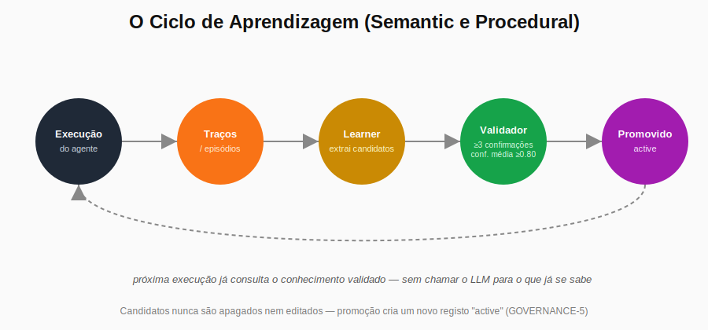

# As 4 Camadas de Memória que Podem Mudar a Forma Como Construímos Agentes de IA

Salve, malta.

Há um tempo fui contratado para desenvolver o **Simplifika AI**, um assistente de atendimento ao cliente com inteligência artificial. O objectivo, à superfície, é simples: responder dúvidas dos clientes com base no conhecimento da empresa. Mas quanto mais avançava no projecto, mais ficava claro que dava para ir muito além do básico.

Foi assim que nasceu o **CortexOS**, o kernel cognitivo por trás do Simplifika. Um agente construído em PHP, com Finite State Machine (FSM), reflexão em camadas, roteamento inteligente e, sobretudo, uma arquitectura de memória pensada para evolução real, não só para "lembrar coisas".

Não quero vender o projecto aqui. Quero partilhar uma ideia que considero importante para quem está a construir agentes e chatbots: **como desenhar uma memória de qualidade**, em vez de depender só de prompts gigantes e busca vectorial.

## O padrão que quase todo mundo usa, e onde ele falha

Hoje, a maioria dos agentes segue mais ou menos o mesmo modelo:

- Enche o prompt com o máximo de contexto possível (*prompt stuffing*);
- Usa uma **vector store + RAG** (Retrieval-Augmented Generation) para ir buscar documentos relevantes.

Este padrão popularizou-se porque é relativamente fácil de implementar e funciona bem no início. Vês isto em LangChain, LlamaIndex, CrewAI, AutoGen e em quase todos os tutoriais de agentes que existem por aí.

**Por que se tornou o padrão?** Porque é o caminho mais rápido. O RAG, popularizado pelo paper de 2020, resolveu um problema real: os LLMs esquecem e não têm acesso a dados privados. Mas com o tempo, este modelo mostra as suas limitações:

- O agente não "aprende" de verdade, só recupera informação já existente.
- A cada nova conversa, gasta tokens a repetir o mesmo contexto.
- Há dificuldade em acumular conhecimento ao longo do tempo.
- Erros repetem-se, porque não existe validação estruturada do que foi "aprendido".

Para o Simplifika, eu queria algo diferente.

## A proposta: 4 camadas de memória, cada uma com um papel definido

Em vez de "contexto + RAG", estruturei a memória do CortexOS em **quatro camadas**, cada uma com uma responsabilidade clara e uma forma de persistência diferente.

### 1. Working Memory, a RAM do agente

É o estado imediato da conversa: entidades activas, último resultado de uma tool, notas temporárias. Vive em cache com TTL de 1 hora, e as actualizações fazem *merge*, nunca substituem o estado completo da sessão. É rápida e propositadamente volátil: quando a sessão fecha, não há razão para guardar isto para sempre.

### 2. Episodic Memory, os episódios já vividos

Aqui ficam resumos comprimidos de conversas anteriores, pesquisáveis por similaridade semântica via embeddings. O CortexOS não guarda a conversa toda, guarda o suficiente para reconhecer "já vi uma situação parecida com esta". A compressão acontece de forma assíncrona, fora do caminho crítico da execução: um episódio entra com status `pending_compression` e só depois é processado por um job dedicado.

### 3. Semantic Memory, os factos consolidados

Esta é a camada de conhecimento validado sobre o negócio. Coisas como "o prazo máximo de entrega é 5 dias úteis" ou "o IVA em Angola é 14%". E aqui está o ponto mais importante: **isto não é apenas vector search**. Existe um pipeline real:

1. O Learner observa execuções e propõe **candidatos**, cada proposta para o mesmo facto conta como uma confirmação independente.
2. Um validador (`SemanticValidator`) só promove um candidato a **activo** quando ele aparece em pelo menos **3 confirmações distintas**, com uma confiança média de pelo menos **0.80**.
3. Um facto activo nunca é apagado nem editado directamente. Corrigi-lo cria um novo registo, marcando o antigo como `superseded`, todo o histórico fica auditável.

Esta regra de "nunca apagar, só substituir" é tratada como invariante de governação no sistema: cada decisão de conhecimento deixa rasto.

### 4. Procedural Memory, a minha camada favorita

Aqui ficam **sequências de acções que já provaram funcionar**. Por exemplo: "quando o cliente pergunta sobre factura em atraso, o fluxo X resolve a maior parte das vezes". Cada procedimento acumula uma taxa de sucesso (`success_rate`) e um tamanho de amostra (`sample_size`).

Quando um procedimento atinge **pelo menos 20 execuções observadas** e uma taxa de sucesso de **85% ou mais**, ele é promovido automaticamente a `active`, mas só se for classificado como baixo impacto. Procedimentos de alto impacto, mesmo com bons números, vão para `pending_approval`: alguém humano tem de aprovar antes do agente passar a executá-los sem chamar o LLM.

## Tudo passa por um único ponto: o MemoryBus

Nenhuma parte do agente acede a uma camada de memória directamente. Toda a leitura e escrita passa por uma fachada única, o `MemoryBus`.

Isto traz duas vantagens práticas, que só ficaram óbvias depois de testar o sistema:

- **Isolamento para testes.** Como o `MemoryBus` é `final`, qualquer consumidor que dependesse dele directamente seria impossível de isolar num teste unitário sem tocar nas dependências concretas (cache, base de dados, API Python). Por isso existe uma interface (`MemoryBusInterface`), quem consome só conhece o contrato, nunca a implementação.
- **Falhas isoladas não derrubam o agente.** Cada método do bus tem o seu próprio `try/catch`. Se a camada episódica falhar (por exemplo, o serviço Python estiver fora do ar), o agente continua a funcionar com memória vazia nessa camada, em vez de falhar a execução toda.

## O ciclo que realmente faz a diferença

Ter quatro camadas separadas, por si só, não resolve nada. O que importa é o ciclo completo:

Agente executa → gera traços (episódios, resultados de tools) → o Learner analisa e produz candidatos → o validador promove o que é suficientemente confiável → a memória é actualizada → a próxima conversa já usa o que foi aprendido, sem voltar a "descobrir" a mesma coisa.

Com o tempo, o agente fica mais rápido, mais barato e mais consistente, porque uma parte cada vez maior das decisões deixa de depender de uma chamada ao LLM.

## Qual é a diferença real?

A maioria dos frameworks de agentes hoje foca-se em **recuperar** informação. O CortexOS foca-se em **acumular e validar** conhecimento, e trata isso como um pipeline de governação, não como um detalhe de implementação.

Poucas equipas têm algo assim de forma aberta hoje. A Anthropic e a OpenAI estão a explorar memória de longo prazo em agentes, mas na prática a maioria das soluções empresariais ainda vive inteiramente no modelo RAG + prompt grande. Empresas como Adept, Imbue e algumas startups de agentes autónomos estão a ir nesta direcção, mas continua a ser território pouco explorado em produção.

## Para quem está a construir agentes

Se estás a criar um agente ou chatbot, vale a pena perguntar:

- Quanto do teu agente realmente aprende com o tempo, em vez de só recuperar?
- Quanto ainda depende de chamar o LLM em praticamente todas as interacções?
- Tens um critério explícito para validar o que ele "aprende", ou confias cegamente no primeiro padrão que aparece?

A memória não é a parte mais glamorosa de um agente. Mas é provavelmente a que mais pesa na qualidade a longo prazo.

## Referências

Este artigo apoia-se em trabalho publicado, não inventa os conceitos do zero:

- Lewis, P. et al. (2020). *Retrieval-Augmented Generation for Knowledge-Intensive NLP Tasks*. NeurIPS. https://arxiv.org/abs/2005.11401
- Sumers, T. et al. (2023). *Cognitive Architectures for Language Agents* (CoALA). arXiv:2309.02427. https://arxiv.org/abs/2309.02427
- Anderson, J. R. (2007). *How Can the Human Mind Occur in the Physical Universe?* Oxford University Press (ACT-R). https://act-r.psy.cmu.edu/
- Laird, J. E. (2012). *The Soar Cognitive Architecture*. MIT Press. https://soar.eecs.umich.edu/
- Park, J. S. et al. (2023). *Generative Agents: Interactive Simulacra of Human Behavior*. arXiv:2304.03442. https://arxiv.org/abs/2304.03442
- Packer, C. et al. (2023). *MemGPT: Towards LLMs as Operating Systems*. arXiv:2310.08560. https://arxiv.org/abs/2310.08560
- Zhong, W. et al. (2023). *MemoryBank: Enhancing Large Language Models with Long-Term Memory*. arXiv:2305.10250. https://arxiv.org/abs/2305.10250

Lista completa, com notas sobre onde o CortexOS segue a literatura e onde diverge, em [`REFERENCES.md`](./REFERENCES.md).

---

E tu? Qual tem sido o maior desafio ao construir memória nos teus agentes? Já tentaste separar memória procedural de memória semântica?

Deixa nos comentários, vou ler e responder.
